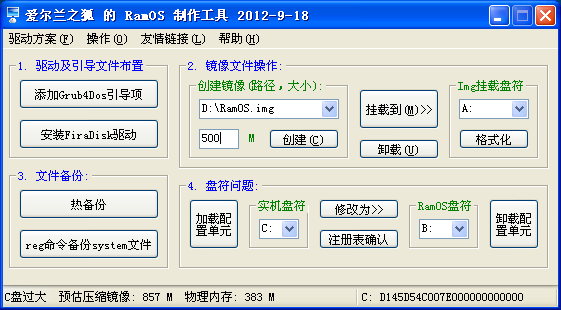
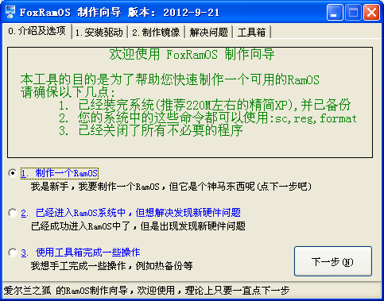
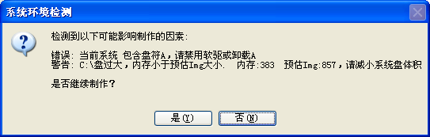
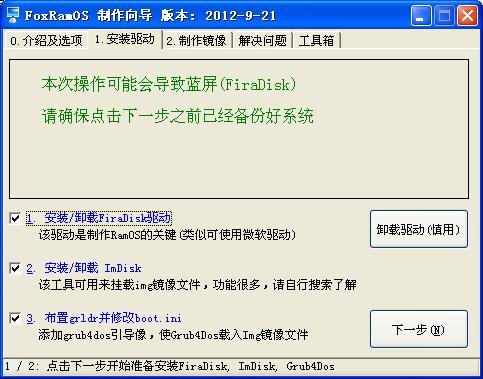
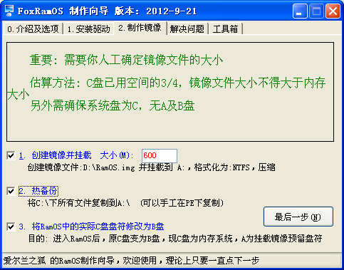
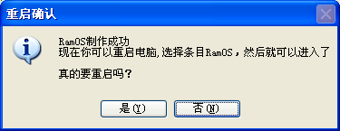
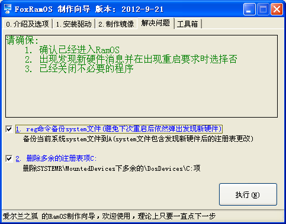
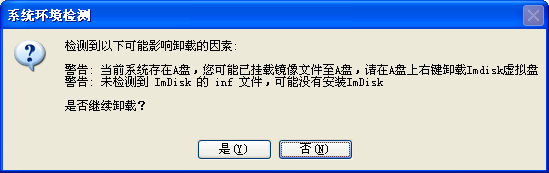

# FoxRamOS

**功能:** RamOS制作辅助工具 Firadisk + img

**适用范围:** XP,2003

**语言:** [Autohotkey](http://www.autohotkey.com)

**缘起:** 一开始使用深度的制作工具，不过为了方便菜鸟，隐藏了不少细节，故到无忧学习如何手工制作后，兴起了制作辅助工具的想法

**版本分别:**

-  第一版: 所有功能全部放在一个界面上
-  导航版: 应[Olsoul](http://go.olsoul.com)要求，方便未接触过RamOS的童鞋使用，简化制作步骤，尽量智能化

## 下载

最新版本: 2012-9-18

**Exe打包下载:**

 - [FoxRamOS.7z](../../releases/download/2012-09-18/FoxRamOS.7z)　解压密码:55555
 - <http://pan.baidu.com/s/1bnqxdjL>

**源码:**

 - [FoxRamOS.ahk](FoxRamOS.ahk)
 - [FoxRamOS_Guide.ahk](FoxRamOS_Guide.ahk)

## 第三方程序(版权归各自作者所有)
- FiraDisk
- Grub4Dos
- imDisk
- RamDisk
- VDM
- devcon
- RawRead
- strarc

## 截图及用法

**第一版:版截图(适用老鸟，一切可控，只简化手工操作):**

* * * * *

**导航版:截图(适用新手，简化步骤):**

 **1:**选择操作界面，要制作RamOS，选1，然后点击下一步

 

 **　　1.1:**如果检测到系统不符合制作要求的(例如:系统精简不够，内存过小，未关闭虚拟内存，缺少必要文件)，会弹出对话框

 

 **2:**安装驱动界面，直接点击下一步

 

 **3:**制作镜像界面，填好镜像大小，直接点击最后一步

 

 **　　3.1:**制作成功，弹出要求重启对话框，选是直接重启，进系统选择FoxRamOS进入RamOS

 

 **4:**进入RamOS后会发现新硬件RamDisk,要求重启，此时选择否，打开本工具，切换到这个页面，点执行按钮即可

 

* * * * *

**卸载驱动(2012-9-21新增按钮):**进入普通系统，运行本程序，切换到标签 1.安装驱动，点击卸载驱动按钮
 

